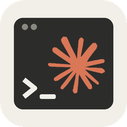

# Claude Workbench for Home Assistant

[](claude-workbench/CHANGELOG.md)
[](https://github.com/Eifel-Joe/claude-workbench/releases)
[](LICENSE)
[](#architecture-support)
[](claude-workbench/Dockerfile)



Claude Workbench is a Home Assistant app that runs Anthropic's **Claude Code CLI** in a browser-based terminal, right inside your dashboard. It ships the tools you need for Home Assistant work — the `ha` and `gh` CLIs, git, Python — keeps your session alive across restarts with tmux, updates Claude Code on every start so new models work right away, and lets you install extra packages that survive reboots.


**Highlights**

- **Always current Claude Code** — updated on every start, plus a 🔄 *Update Claude Code* menu item
- **Secure by default** — reachable only through the Home Assistant sidebar (ingress), no open port
- **Phone-friendly terminal** — copy, swipe scrolling, on-screen keyboard, image paste, clickable login links
- **Persistent packages** — `persist-install` keeps apk and pip packages across restarts
- **Remote Control** and access to other apps' config folders
- **One-step switch from Claude Terminal Pro** — see below

Claude Workbench grew out of Claude Terminal Pro; see [Credits](#credits).

## Switching from Claude Terminal Pro

This works for ESJavadex's Claude Terminal Pro and for this project's own app before 3.0.0 (it was called Claude Terminal Pro, too). Home Assistant treats Claude Workbench as a new app, so it is installed next to the old one:

1. Add the repository `https://github.com/Eifel-Joe/claude-workbench` (see [Install](#install)).
2. Install **Claude Workbench** and start it.
3. Open the panel. Claude Workbench finds the old app and offers to take over your Claude memories, `CLAUDE.md`, history, logins, packages and settings — via a partial backup of the old app, which is kept as a fallback. The old app is stopped afterwards.
4. Once everything works, uninstall the old app.
5. Remove the old repository entry (**Settings → Apps → App Store → ⋮ → Repositories**). This project's old URL (ending in `claude-code-ha`) is redirected by GitHub to the new one, so Claude Workbench would otherwise show up twice.

---

## Install

[](https://my.home-assistant.io/redirect/supervisor_add_addon_repository/?repository_url=https%3A%2F%2Fgithub.com%2FEifel-Joe%2Fclaude-workbench)

Or add it manually:

1. **Settings → Apps → App Store**
2. Top-right menu (⋮) → **Repositories**
3. Add `https://github.com/Eifel-Joe/claude-workbench` and click **Add**
4. Install **Claude Workbench**, start it, and open the panel from the sidebar

Authentication uses OAuth — no API key or config needed for a normal setup. The terminal opens in your `/config` directory.

---

## Features

### Terminal & session
- **Web terminal** via ttyd, embedded in the HA sidebar (`code-braces-box` panel icon) — reachable only through Home Assistant ingress, no host ports
- **Auto-launch** Claude on open, or an interactive **session picker** (`auto_launch_claude`)
- **Persistent tmux session** — closing the browser tab or restarting Home Assistant Core does not kill your Claude session; reopening reattaches to the same one
- **Remote Control** — start Claude paired with claude.ai/code and the Claude app (`remote_control`)
- **Reliable browser copy/paste** — tmux mouse capture is **off by default** so pasting works (including OAuth login codes); re-enable with `tmux_mouse` if you prefer tmux mouse selection

### Bundled tooling
- **Claude Code CLI** — latest native release on amd64/aarch64
- **Home Assistant CLI** (`ha`) — talk to Supervisor and Core from the terminal
- **GitHub CLI** (`gh`) — with persistent auth
- **git, Python 3 + pip, Node.js, jq, yq, vim, nano, tree** and more, out of the box
- **Claude Code skills & commands** for Home Assistant pre-installed

### Persistence & packages
- **Everything in `/data`** survives reboots and app updates (auth, config, packages)
- **`persist-install`** — install APK/pip packages that stick across restarts, into an isolated Python venv
- **Auto-install** — declare packages in the config and they install on startup (`persistent_apk_packages`, `persistent_pip_packages`)
- **Always-current Claude Code** — kept in `/data/npm` and updated on each start (on by default: `use_persistent_claude`, `auto_update_claude_on_start`), validated before activation; or update manually from the session picker

### Extras
- **Image paste** — paste (Ctrl+V), drag-drop, or upload images for Claude to analyze (JPEG/PNG/GIF/WebP/SVG, ~10 MB), stored in `/data/images/`. Lightweight service (~10 MB RAM), ARM-compatible
- **Unrestricted mode** — optionally run Claude with `--dangerously-skip-permissions` for full file access (`dangerously_skip_permissions`)

---

## Configuration

| Option | Default | Description |
| --- | --- | --- |
| `auto_launch_claude` | `true` | Start Claude automatically, or show the session picker |
| `remote_control` | `false` | Start the auto-launched session with `--remote-control` (claude.ai/code, Claude app) |
| `remote_control_session_name` | `""` | Optional name for the Remote Control session |
| `tmux_mouse` | `false` | Enable tmux mouse mode. Keep off for native browser copy/paste |
| `dangerously_skip_permissions` | `false` | Run Claude with unrestricted file access |
| `persistent_apk_packages` | `[]` | Alpine (APK) packages to auto-install on startup |
| `persistent_pip_packages` | `[]` | Python (pip) packages to auto-install on startup |
| `use_persistent_claude` | `true` | Use a Claude Code install kept in `/data/npm` instead of the baked-in one |
| `auto_update_claude_on_start` | `true` | When the override is enabled, update it on each start |

**Example:**

```yaml
auto_launch_claude: true
tmux_mouse: false
dangerously_skip_permissions: false
persistent_apk_packages:
  - htop
  - ripgrep
persistent_pip_packages:
  - httpx
```

See [DOCS.md](claude-workbench/DOCS.md) for the full guide.

---

## Quick start

```bash
# Ask Claude directly
claude "Write a Home Assistant automation that turns on the porch light at sunset"

# Interactive session
claude

# Install a package that survives restarts
persist-install ripgrep
persist-install --python httpx

# Use the bundled CLIs
ha core info
gh repo list
```

---

## Architecture support

| Architecture | Claude Code | Home Assistant CLI | GitHub CLI |
| --- | --- | --- | --- |
| `amd64` | native, latest | latest | latest |
| `aarch64` | native, latest | latest | latest |

32-bit systems (armv7, armhf, i386) are not supported: Home Assistant ended support for them with 2025.12, and the Supervisor there no longer offers app updates. Version 2.2.2 was the last release built for armv7.

---

## Recommended: Home Assistant plugins for Claude

Pair the app with the **[Claude Home Assistant Plugins](https://github.com/ESJavadex/claude-homeassistant-plugins)** for HA-specific tools and context (entity management, automation helpers, and more):

```bash
npx claude-plugins install @ESJavadex/claude-homeassistant-plugins/homeassistant-config
```

This drops a `CLAUDE.md` into your config directory with context tailored for Home Assistant development.

---

## Documentation

- [App documentation](claude-workbench/DOCS.md) — options, usage, persistent packages
- [Development guide](DEVELOPMENT.md) — build and test the app locally
- [Changelog](claude-workbench/CHANGELOG.md) — release history

## Community tools

- **[ha-ws-client-go](https://github.com/schoolboyqueue/home-assistant-blueprints/tree/main/scripts/ha-ws-client-go)** by [@schoolboyqueue](https://github.com/schoolboyqueue) — lightweight Go CLI for the Home Assistant WebSocket API. Gives Claude direct access to entity states, service calls, automation traces, and real-time monitoring. Single binary, no dependencies.

## Support

Found a bug or have a request? [Open an issue](https://github.com/Eifel-Joe/claude-workbench/issues).

## Credits

Claude Workbench is maintained by [@Eifel-Joe](https://github.com/Eifel-Joe). It grew out of
**Claude Terminal Pro** and would not exist without the people who built it:

- **Javier Santos** ([@ESJavadex](https://github.com/ESJavadex)) — created Claude Terminal Pro
  ([ESJavadex/claude-code-ha](https://github.com/ESJavadex/claude-code-ha)): persistent packages,
  tmux persistence, multi-arch and much more. Greetings and thanks, Javier! More of his
  AI + Home Assistant work: [Javadex](https://www.javadex.es/)
- **Tom Cassady** ([@heytcass](https://github.com/heytcass)) — created the original Claude Terminal app
  ([heytcass/home-assistant-addons](https://github.com/heytcass/home-assistant-addons))
- **Community fork contributions:** [@Moulbi](https://github.com/Moulbi),
  [@PeterLinuxOSS](https://github.com/PeterLinuxOSS), [@nsleigh](https://github.com/nsleigh),
  [@marcjay](https://github.com/marcjay), [@martinboksa](https://github.com/martinboksa) —
  each change is credited in the [changelog](claude-workbench/CHANGELOG.md)

Built and maintained with the help of Claude Code itself.

**Trademarks:** Claude, Claude Code and the Claude spark logo are trademarks of Anthropic.
Claude Workbench is an independent community project and is not made or endorsed by Anthropic.

## License

MIT — see [LICENSE](LICENSE).
