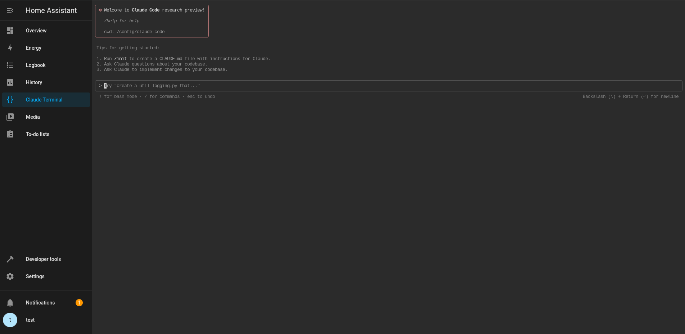

# Claude Workbench for Home Assistant

A workbench for Anthropic's Claude Code CLI in Home Assistant: web terminal, persistent packages, HA and GitHub CLIs.



*Claude Workbench running in Home Assistant*

> Claude Workbench grew out of Claude Terminal Pro by Javier Santos ([ESJavadex/claude-code-ha](https://github.com/ESJavadex/claude-code-ha)), which builds on Tom Cassady's Claude Terminal ([heytcass/home-assistant-addons](https://github.com/heytcass/home-assistant-addons)). See [Credits](#credits).

## What is Claude Workbench?

This app provides a web-based terminal interface with Claude Code CLI pre-installed plus persistent package management, allowing you to use Claude's powerful AI capabilities directly from your Home Assistant dashboard. It gives you direct access to Anthropic's Claude AI assistant through a terminal, ideal for:

- Writing and editing code
- Debugging problems
- Learning new programming concepts
- Creating Home Assistant scripts and automations

## Features

### Core Features
- **Web Terminal Interface**: Access Claude through a browser-based terminal using ttyd
- **Auto-Launch**: Claude starts automatically when you open the terminal
- **Claude Code CLI**: Latest native release
- **No Configuration Needed**: Uses OAuth authentication for easy setup
- **Direct Config Access**: Terminal starts in your `/config` directory for immediate access to all Home Assistant files
- **Home Assistant Integration**: Access directly from your dashboard
- **Panel Icon**: Quick access from the sidebar with the code-braces-box icon
- **Shift+Enter**: Inserts a new line in Claude's input instead of sending it
- **Auto-Continue (opt-in)**: After a usage limit, types `continue` once the limit has reset; off by default, switchable from the panel header
- **Multi-Architecture Support**: Works on amd64 and aarch64
- **Secure Credential Management**: Persistent authentication with safe credential storage
- **Automatic Recovery**: Built-in fallbacks and error handling for reliable operation

### Persistent Packages and Tools
- **Persistent Package Management**: Install APK and pip packages that survive container restarts
- **Auto-Install Configuration**: Configure packages to install automatically on startup
- **Python Virtual Environment**: Isolated Python environment in `/data/packages`
- **Simple Commands**: Use `persist-install` for easy package management
- **Persistent Storage**: All packages stored in `/data` which survives all reboots
- **Optional Persistent Claude Override**: Advanced users can opt into a Claude Code install stored in `/data/npm`

## Quick Start

The terminal automatically starts Claude when you open it. You can immediately start using commands like:

```bash
# Ask Claude a question directly
claude "How can I write a Python script to control my lights?"

# Start an interactive session
claude -i

# Get help with available commands
claude --help

# Debug authentication if needed
claude-auth debug

# Log out and re-authenticate
claude-logout
```

## Installation

1. Add this repository to your Home Assistant app store:
   - Go to Settings → Apps → App Store
   - Click the menu (⋮) and select Repositories
   - Add: `https://github.com/Eifel-Joe/claude-workbench`
2. Install the Claude Workbench app
3. Start the app
4. Click "OPEN WEB UI" or the sidebar icon to access
5. On first use, follow the OAuth prompts to log in to your Anthropic account

## Switching from Claude Terminal Pro

This works for ESJavadex's Claude Terminal Pro and for this project's own app before 3.0.0 (it was called Claude Terminal Pro, too). Home Assistant treats Claude Workbench as a new app, so it is installed next to the old one:

1. Add the repository `https://github.com/Eifel-Joe/claude-workbench` (see Installation).
2. Install **Claude Workbench** from the repository you just added — its app page address ends in `0e003122_claude_workbench` — and start it. Coming from this project's old app, the store lists Claude Workbench twice until step 5: the other one (`6ef0b4d0_claude_workbench`) comes through the old address, and its repository entry could then never be removed.
3. Open the panel. Claude Workbench finds the old app and offers to take over your Claude memories, `CLAUDE.md`, history, logins, packages and settings — via a partial backup of the old app, which is kept as a fallback. The old app is stopped afterwards.
4. Once everything works, uninstall the old app.
5. Remove the old repository entry (**Settings → Apps → App Store → ⋮ → Repositories**). This project's old URL (ending in `claude-code-ha`) is redirected by GitHub to the new one, so Claude Workbench would otherwise show up twice.

## Configuration

The app works out of the box, but also supports a few optional advanced settings:

- **Access**: through the Home Assistant sidebar panel (ingress) only. The app
  publishes no host port: `ttyd` runs writable with no credentials, so exposing it
  on the LAN meant an unauthenticated root shell. See CHANGELOG 2.1.0.
- **Authentication**: OAuth with Anthropic (credentials kept in the app's private `/data`, under `/data/home/.claude`, not in `/config`)
- **Terminal**: Full bash environment with Claude Code CLI pre-installed
- **Persistent Claude override**: Optional `use_persistent_claude` / `auto_update_claude_on_start`
- **Volumes**: `/config` (Home Assistant configuration) and `/addon_configs` (the other apps' folders), both read-write

## Troubleshooting

### Authentication Issues
If you have authentication problems:
```bash
claude-auth debug    # Show credential status
claude-logout        # Clear credentials and re-authenticate
```

### Container Issues
- Credentials are automatically saved and restored between restarts
- Check app logs if the terminal doesn't load
- Restart the app if Claude commands aren't recognized

### Development
For local development and testing:
```bash
# Enter development environment
nix develop

# Build and test locally
build-addon
run-addon

# Lint and validate
lint-dockerfile
test-endpoint
```

## Architecture

- **Base Image**: Home Assistant Alpine Linux base (3.21)
- **Container Runtime**: Compatible with Docker/Podman
- **Web Terminal**: ttyd for browser-based access
- **Process Management**: s6-overlay for reliable service startup
- **Networking**: Ingress support with Home Assistant reverse proxy

## Security

- **Who can open the terminal: every signed-in Home Assistant user, not only
  administrators.** The app sets `panel_admin: true`, but that only hides the
  sidebar entry from non-admins. Home Assistant's ingress view accepts any
  valid ingress session, and Home Assistant deliberately lets every signed-in
  user create one and read an app's ingress URL
  (`homeassistant/components/hassio/ingress.py`: `requires_auth = False`;
  `websocket_api.py`: `WS_NO_ADMIN_ENDPOINTS`, since home-assistant/core#60120).
  The Supervisor checks the session, not the user's role. Checked against
  Home Assistant Core and Supervisor on 2026-10-09; the app cannot change it.
- **What is behind the panel:** a root shell in the app's container that can
  write your whole Home Assistant configuration (`/config`) and the other
  apps' folders (`/addon_configs`), and holds `SUPERVISOR_TOKEN` with the
  Supervisor's `manager` role (manage apps and backups, restart Home
  Assistant and the host; checked in the Supervisor's `security.py`). With
  `dangerously_skip_permissions` on, Claude acts there without asking.
  Auto-continue (off by default) lets Claude go on unattended after a usage
  limit; with `dangerously_skip_permissions` that includes commands.
- **No open port:** the app publishes no host port. The terminal (`ttyd`)
  listens on `127.0.0.1` only and is reached through Home Assistant ingress,
  which requires a Home Assistant login.
- **What follows:** treat every account on your Home Assistant as trusted
  while this app is installed. If you hand out limited accounts (family,
  guests, a wall tablet), stop or uninstall the app.
- **Login data** for Claude stays in the app's private `/data`
  (`/data/home/.claude`, mode 600), not in `/config`.

## Development Environment

This app includes a comprehensive development setup using Nix:

```bash
# Available development commands
build-addon      # Build the app container with Podman
run-addon        # Run app locally on port 7680
lint-dockerfile  # Lint Dockerfile with hadolint
test-endpoint    # Test web endpoint availability
```

**Requirements for development:**
- NixOS or Nix package manager
- Podman (automatically provided in dev shell)
- Optional: direnv for automatic environment activation

## Documentation

For detailed usage instructions, see the [documentation](DOCS.md).

## Version History

See the [changelog](CHANGELOG.md).

## Useful Links

- [Claude Code Documentation](https://docs.anthropic.com/claude/docs/claude-code)
- [Get an Anthropic API Key](https://console.anthropic.com/)
- [Claude Code GitHub Repository](https://github.com/anthropics/claude-code)
- [Home Assistant Apps](https://www.home-assistant.io/addons/)

## Credits

**Maintainer:** [@Eifel-Joe](https://github.com/Eifel-Joe)
**Claude Terminal Pro:** Javier Santos ([@ESJavadex](https://github.com/ESJavadex)) — persistent package management and many enhancements Claude Workbench builds on
**Original Claude Terminal:** Tom Cassady ([@heytcass](https://github.com/heytcass)) — the initial app

Claude, Claude Code and the Claude spark logo are trademarks of Anthropic. Claude Workbench is an independent community project and is not made or endorsed by Anthropic.

This app was created and enhanced with the assistance of Claude Code itself! The development process, debugging, and documentation were all completed using Claude's AI capabilities - a perfect demonstration of what this app can help you accomplish.

## License

This project is licensed under the MIT License - see the [LICENSE](../LICENSE) file for details.
